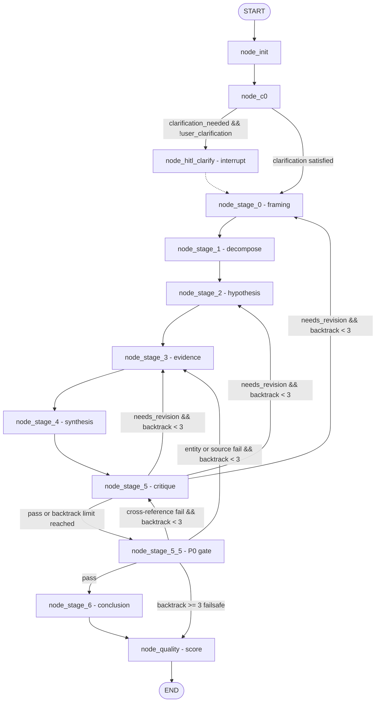

# cr-reasoning-v2

Next-generation reasoning pipeline ported from `claude-reasoning-1.2.0` to LangGraphJS with SQLite state persistence, deterministic verification gates, bounded defect backtracking, and dual MCP stdio + CLI entry points.

## Architecture: Skeleton vs Brain Split

`cr-reasoning-v2` decouples control flow orchestration from reasoning intelligence:

```
                  ┌─────────────────────────────────────────────────────────┐
                  │                 Skeleton (TypeScript host)              │
                  │  - LangGraphJS StateGraph                               │
                  │  - SQLite checkpointing (SqliteSaver)                   │
                  │  - Deterministic P0 gates & 4-dimension scoring         │
                  │  - Bounded backtracking routing & single-writer counter │
                  └────────────────────────────┬────────────────────────────┘
                                               │ Passive LlmInvoker
                                               ▼
                  ┌─────────────────────────────────────────────────────────┐
                  │                  Brain (LLM & Prompts)                  │
                  │  - 22 zero-migration prompt assets                      │
                  │  - Stage-specific structured output schemas (Zod)       │
                  │  - Fail-loud parsing with single-attempt repair         │
                  └─────────────────────────────────────────────────────────┘
```

### Graph Topology



## Deterministic Verification & Bounded Backtracking

- **P0 Anti-Hallucination Gate (`node_stage_5_5`)**: Triple-check verifying entity grounding, citation source anchors, and cross-reference disclosure for low-confidence evidence contradictions.
- **Stage 6 Conclusion Gates**: 4 verification gates (`gate_1_evidence`, `gate_2_boundary`, `gate_3_counter_evidence`, `gate_4_confidence`).
- **Single-Writer Routing Bounds**:
  - Global defect backtrack limit: $\le 3$ (`BACKTRACK_MAX`).
  - Stage 0 framing revision limit: $\le 1$ (`STAGE_0_REVISIONS_MAX`).
  - Safe convergence on budget exhaustion: writes `BACKTRACK_LIMIT_EXCEEDED` to `residual_uncertainty`, forces `needs_revision: false`, and progresses to `node_quality`.

## Quickstart

### 1. CLI Usage

```bash
# Run a reasoning session
cr-reasoning run "Should we adopt SQLite checkpointer in production?" --mode decision

# Output JSON state
cr-reasoning run "Should we migrate from MySQL to Postgres?" --mode decision --json

# Resume after HITL clarification or crash
cr-reasoning resume cr-1718290000000 --input "On-premise deployment with max 10k budget"
```

CLI arguments:
- `run "<question>"`: required positional prompt.
- `--mode <decision|design|diagnostic|innovation|optimization>`: primary mode (default `decision`).
- `--config <path>`: path to `config.yaml` (default `./config.yaml`).
- `--json`: output raw JSON containing `{ threadId, state }`.
- `resume <threadId> --input "<text>"`: resume thread with clarification answer or continue paused run.

### 2. Claude Desktop Integration (`mcp_servers.json`)

```json
{
  "mcpServers": {
    "cr-reasoning": {
      "command": "node",
      "args": ["C:/tmp/DONE/cr-reasoning-v2/dist/mcp.js"],
      "env": {
        "CR_REASONING_BASE_URL": "https://api.openai.com/v1",
        "CR_REASONING_API_KEY": "sk-...",
        "CR_REASONING_MODEL": "gpt-4o"
      }
    }
  }
}
```

Registered MCP tools:
- `cr_reason({ question: string, mode?: string })`: runs graph reasoning pipeline.
- `cr_resume({ threadId: string, input?: string })`: resumes paused/interrupted reasoning thread.

### 3. Configuration (`config.yaml` / Environment Variables)

Configuration precedence:
- Environment variables: `CR_REASONING_BASE_URL`, `CR_REASONING_API_KEY`, `CR_REASONING_MODEL`, `CR_REASONING_CONFIG`, `CR_REASONING_DB_PATH`.
- Local configuration file `config.yaml`:
  ```yaml
  baseUrl: "https://api.openai.com/v1"
  apiKey: "your-api-key"
  model: "gpt-4o"
  ```

### 4. Offline Testing Guarantee & Zero-Migration Prompts

- **Zero-Migration**: All 22 prompt assets under `prompts/` are bit-for-bit identical to `claude-reasoning-1.2.0` (validated via SHA256 integrity checks in `test/unit/prompt-assets.test.ts`).
- **Offline Invariant**: Test fixtures use `MockLlmInvoker` and custom script invokers without outbound HTTP calls or API keys.
- **Hook for External Integration Tests**: `CR_REASONING_INVOKER_MODULE` can specify a custom invoker module exporting `createInvoker(env)`.

## Test Suite

Verified with 100% pass rate:
- **Total Test Files**: 14
- **Total Tests**: 56
- Run checks:
  ```bash
  npm run typecheck    # npx tsc --noEmit
  npm test             # npx vitest run
  ```
