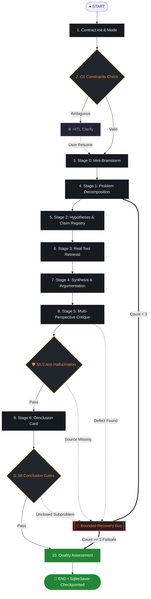

<div align="center">

# 🧠 Claude Reasoning v2 (`claude-reasoning`)

**Next-generation structured reasoning pipeline ported to LangGraphJS host — not another flat expert panel.**

**Skeleton vs Brain · SQLite Checkpointing · Deterministic P0 Gates · Bounded Backtracking · Dual MCP + CLI**

[](LICENSE)
[](package.json)
[](https://www.npmjs.com/package/claude-reasoning)
[](tsconfig.json)
[](https://langchain-ai.github.io/langgraphjs/)
[](src/mcp.ts)
[](test/)

</div>

---

## ⚡ What This Is (and Is Not)

`claude-reasoning` (v2.0.0) is a **production-grade structured reasoning engine**: 8 contracts, 8 stages, 5 reasoning modes, and 1 quality assessment layer — orchestrating problem classification → framing → decomposition → hypothesis → verification → synthesis → critique → anti-hallucination gate → conclusion.

In **v1.2.0**, reasoning was simulated by the LLM reading Markdown templates in its conversation context.  
In **v2.0.0**, the pipeline is executed by a **TypeScript host engine (LangGraphJS StateGraph)** with **SQLite persistent checkpoints**, **deterministic programmatic verification gates**, and **hard-bounded defect backtracking**.

**What this is not:**
- It is **not** a loose multi-agent discussion or flat expert panel.
- It is **not** a prompt wrapper that lets the LLM guess whether its own output passed verification.
- It is **not** an unbounded loop. Backtracking between stages is bounded by mathematical limits ($\le 3$ global backtracks, $\le 1$ Stage 0 revision).
- It is **not** dependent on external network access for testing. The full regression and topology suite runs **100% offline** via deterministic mocks.

---

## 💥 What Makes v2.0.0 Different from v1.2.0

| Dimension | v1.2.0 (Markdown Skill) | v2.0.0 (TypeScript + LangGraphJS Engine) |
|---|---|---|
| **Architecture** | Prompt-driven DAG simulation in LLM context | **Skeleton vs Brain split**: TypeScript host runs graph; LLM is a passive invoker |
| **State Persistence** | Transient conversation memory (lost across turns) | **SQLite Checkpointer (`SqliteSaver`)**: auto-saved per super-step, crash-resilient |
| **Context Overhead** | 22 Markdown files read into LLM context (~15k tokens) | **Zero Context Bloat**: host loads prompts; only relevant stage variables injected |
| **Anti-Hallucination** | LLM self-reports adherence in prompt | **Deterministic P0 Gate (`gates.ts`)**: AST/code-level verification of entities & sources |
| **Backtracking Safety** | Unbounded (vulnerable to Stage 2 $\leftrightarrow$ 5 infinite loops) | **Single-Writer Routing Bounds**: `BACKTRACK_MAX <= 3`, `STAGE_0_REVISIONS_MAX <= 1` |
| **Clarification (HITL)** | Model ad-hoc asks user; state resets on reply | **LangGraph `interrupt()`**: pauses graph, resumes via `claude-reasoning resume` / MCP |
| **Interface** | Claude `/skill` slash command only | **Universal Triple Entry**: npm Library API (`claude-reasoning`) + CLI (`claude-reasoning`) + MCP Server |
| **Test Verification** | Manual review only (no automated test suite) | **20 test files, 91/91 automated tests (100% pass rate, tsc clean)** |

---

## 🏛️ Architecture: Skeleton vs Brain Split

```
                  ┌─────────────────────────────────────────────────────────┐
                  │                 Skeleton (TypeScript Host)              │
                  │  - LangGraphJS StateGraph                               │
                  │  - SQLite Checkpointing (SqliteSaver)                   │
                  │  - Deterministic P0 Gates & 4-Dimension Scoring         │
                  │  - Bounded Backtracking Routing & Single-Writer Counter │
                  └────────────────────────────┬────────────────────────────┘
                                               │ Passive LlmInvoker
                                               ▼
                  ┌─────────────────────────────────────────────────────────┐
                  │                  Brain (LLM & Prompts)                  │
                  │  - 22 Zero-Migration Prompt Assets (SHA-256 byte-equal) │
                  │  - Stage-Specific Structured Output Schemas (Zod)       │
                  │  - Fail-Loud Parsing with Single Surgical Repair        │
                  └─────────────────────────────────────────────────────────┘
```

---

## 🔄 Graph Topology & Control Flow



```
[START] ──▶ C0 歧義檢驗 ──▶ S0 框架 ──▶ S1 拆解 ──▶ S2 假說 ──▶ S3 檢索 ──▶ S4 綜合 ──▶ S5 批判
                                ▲                                                      │
                                │                  【🔄 有界回溯總線】                  ▼
                                └────── [回溯次數 < 3] ◀── 門禁攔截 (S5.5 / S6) ───┤
                                                                                      │
                                [回溯 >= 3 熔斷] ────────────────────────────────────┴──▶ Quality ──▶ [END]
```

### Control Flow & Invariant Matrix

| Node / Transition | Condition | Behavior & Target Route | Invariant Guarantee |
|---|---|---|---|
| **C0 HITL Interrupt** | `clarification_needed && !user_clarification` | Invokes `interrupt()`, checkpoints state in SQLite, waits for `resume` | Rejects proceeding on ambiguous tasks |
| **S5 Defect Backtrack** | `needs_revision && backtrack_count < 3` | Routes to `stage-0`, `stage-2`, or `stage-3` via recovery bus | Single-writer counter mutation prevents infinite loops |
| **S5.5 Anti-Hallucination** | Entity / Source / Cross-Ref check failure | Entity/Source fail routes to `stage-3`; Cross-Ref fail routes to `stage-5` | Eliminates unsourced claims |
| **S6 Decomposition Gate** | Unclosed sub-problems (`revision_count < 1`) | Routes back to `stage-1` for decomposition revision | Limited to at most 1 revision, otherwise records Data Gaps |
| **Failsafe Convergence** | `backtrack_count >= 3` | Bypasses remaining loops, routes straight to `node_quality` | Enforces finite step mathematical termination |

---

## 🧩 5 Reasoning Modes

Auto-routed in `A0` according to problem characteristics (or explicitly overridden):

| Mode | Mechanism | Use For |
|---|---|---|
| 🔍 **Diagnostic** | Symptoms $\to$ Candidate Causes $\to$ Elimination $\to$ Minimal Intervention | System crashes, test failures, bug root causes |
| 🏛️ **Design** | Requirements $\to$ Constraints $\to$ Solution Space $\to$ Pareto Frontier | System architecture, schema & API design |
| ⚖️ **Decision** | Options $\times$ Criteria $\to$ Weighted Scoring $\to$ Sensitivity Analysis | Tech stack selection, vendor comparison |
| ⚡ **Optimization** | Current State $\to$ Gradient Direction $\to$ Step Size $\to$ Convergence | Performance bottleneck tuning, latency optimization |
| 💡 **Innovation** | Break Assumptions $\to$ Recombine Elements $\to$ New Combinations | Novel capability generation, overcoming deadlocks |

---

## 🛡️ Deterministic Gates & Precision Audit

v2.0.0 replaces prompt honor-systems with hard code verifications in `src/kernel/gates.ts`:

### 1. P0 Anti-Hallucination Gate (`node_stage_5_5`)
- **Entity Grounding**: Every named entity in the conclusion must trace back to the query or verified evidence in `evidence_matrix`.
- **Source Anchoring**: Citations (`[src-X]`) must exist in `source_quality_matrix`.
- **Cross-Reference Disclosure**: Low-confidence or conflicting evidence cannot be silently dropped.

### 2. Stage 6 Conclusion Gates (`conclusionGates`)
- `gate_1_evidence`: Is evidence quality `Sufficient`?
- `gate_2_boundary`: Are boundary conditions explicitly marked?
- `gate_3_counter_evidence`: Is the cheapest falsifier explicitly refuted?
- `gate_4_confidence`: Is conclusion certainty calibrated to evidence tier?

### 3. Bounded Backtracking Invariants
- `BACKTRACK_MAX = 3`: Maximum total defect revisions allowed.
- `STAGE_0_REVISIONS_MAX = 1`: Framing revisions capped to prevent goal-post shifting.
- **Budget Exhaustion Protection**: If limits are reached, the system writes `[BACKTRACK_LIMIT_EXCEEDED]` to `residual_uncertainty`, forces `needs_revision: false`, and routes straight to `node_quality` with explicit uncertainty warnings.

---

## 🚀 Quick Start

### 1. Installation

```bash
# Clone and install dependencies
git clone https://github.com/okokjai/claude-reasoning.git
cd claude-reasoning
npm install
npm run build
```

### 2. Configuration (`config.yaml` / Environment Variables)

Create a `config.yaml` in your working directory or set environment variables:

```yaml
baseUrl: "https://api.openai.com/v1"   # Or any OpenAI-compatible endpoint
apiKey: "sk-..."
model: "gpt-4o"
dbPath: "./.claude-reasoning/state.db"  # SQLite checkpoint path
```

Supported environment variables (per-field precedence: `CR_REASONING_*` → generic `ANTHROPIC_*` / `OPENAI_*` → `config.yaml`):
`CR_REASONING_BASE_URL`, `CR_REASONING_API_KEY`, `CR_REASONING_MODEL`, `CR_REASONING_DB_PATH`, `CR_REASONING_TOOL_MODULE`.
`CR_REASONING_TOOL_MODULE` names a JS module exporting `createToolAdapter(env)` used to inject retrieval in place of the default no-op adapter.
Generic fallbacks: `ANTHROPIC_BASE_URL`, `OPENAI_BASE_URL`, `ANTHROPIC_AUTH_TOKEN`, `ANTHROPIC_API_KEY`, `OPENAI_API_KEY`, `ANTHROPIC_MODEL`.

`config.yaml` is **optional** — when env already supplies `baseUrl`, the file is not consulted. This lets the engine inherit the ambient session's provider (e.g. a `cc-switch` local proxy on `127.0.0.1`) without duplicating credentials.

---

## 💻 Usage & Universal Entry Points

### 1. CLI Usage

```bash
# Execute structured reasoning
npx claude-reasoning run "Should we migrate our database to SQLite checkpointer in production?" --mode decision

# Output machine-readable JSON state
npx claude-reasoning run "How to optimize memory usage in LangGraphJS?" --mode optimization --json

# Resume after HITL interrupt or machine crash
npx claude-reasoning resume cr-1718290000000 --input "On-premise deployment, max 10k budget"
```

### 2. Claude Desktop Integration (MCP Stdio Server)

Installed as a dependency? Use the `claude-reasoning-mcp` bin; otherwise point at the built server:

```json
{
  "mcpServers": {
    "claude-reasoning": {
      "command": "npx",
      "args": ["-y", "claude-reasoning-mcp"],
      "env": {
        "CR_REASONING_BASE_URL": "https://api.openai.com/v1",
        "CR_REASONING_API_KEY": "sk-...",
        "CR_REASONING_MODEL": "gpt-4o",
        "CR_REASONING_DB_PATH": "<path-to-repo>/.claude-reasoning/state.db"
      }
    }
  }
}
```

Serving a local checkout instead:

```json
{
  "mcpServers": {
    "claude-reasoning": {
      "command": "node",
      "args": ["<path-to-repo>/dist/mcp.js"]
    }
  }
}
```

Registered tools available in Claude Desktop:
- `claude_reason` / `cr_reason`: triggers full graph reasoning (`{ question: string, mode?: string }`).
- `claude_resume` / `cr_resume`: resumes paused thread with clarification answers (`{ threadId: string, input?: string }`).

### 3. Programmatic TypeScript API

```typescript
import { reason, resume } from "claude-reasoning";

// Run reasoning
const { threadId, state } = await reason("Analyze potential bottleneck in our token bucket implementation", {
  mode: "diagnostic",
  dbPath: "./state.db",
});

console.log("Conclusion Card:", state.conclusion_card);
console.log("Quality Score:", state.quality_score?.total);
```

---

## 🧪 Test Suite & Invariant Guarantees

Every commit and release satisfies strict verification invariants:

```bash
npm run typecheck    # npx tsc --noEmit -> Exit code 0
npm test             # npx vitest run -> 20 passed (20 Files), 91 passed (91 Tests)
```

- **Zero-Migration Verification**: All 22 prompt assets under `prompts/` are verified byte-for-byte identical to v1.2.0 via SHA-256 (`test/unit/prompt-assets.test.ts`).
- **Offline Reliability**: The entire test suite runs with deterministic mocks (`MockLlmInvoker`), zero external HTTP requests, and zero API token costs.

---

## 📄 License

MIT © [okokjai](https://github.com/okokjai)
